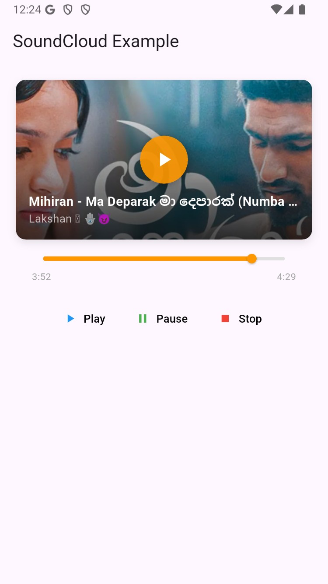
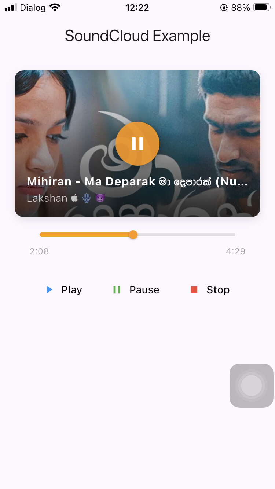

# SoundCloud Flutter App

A Flutter application that allows you to stream and play any public SoundCloud tracks with a fully customizable user interface.

## 📱 Screenshots

| Android Player Screen | Ios Player Screen |
|-------------|---------------|
|  |  |

*Screenshots showcase the customizable UI elements and clean design*

## ✨ Features

- 🎵 **Stream Public SoundCloud Tracks** - Access and play any publicly available audio
- 🎨 **Fully Customizable UI** - Personalize every visual element to match your style  
- 📱 **Cross-Platform Support** - Works seamlessly on both Android and iOS
- 🎧 **Rich Audio Controls** - Full-featured audio player with advanced playback options

## 📋 Platform Support

| Platform | Status |
|----------|--------|
| Android  | ✅ Fully Supported |
| iOS      | ✅ Fully Supported |
| Web      | ❌ Coming Soon |

## 🚀 Getting Started

### Prerequisites

- Flutter SDK (latest stable version)
- Dart SDK 
- Android Studio / VS Code with Flutter extensions
- iOS Simulator (for iOS development)
- Android Emulator or physical device

### Installation

1. **Clone the repository**
```bash
git clone https://github.com/RoshanGunarathna/sound-cloud-player-flutter.git
cd soundcloud_flutter_app
```

2. **Install dependencies**
```bash
flutter pub get
```

3. **Run the application**
```bash
flutter run
```

## 🛠️ Development

### Project Structure
```
lib/
├── main.dart
├── core/
│   └── routing/
└── features/
    └── audio_player/
```

### Key Dependencies
- `flutter` - UI framework
- `get` - State management, dependency injection, and route management
- `webview_flutter` - for displaying web content, in this case, the SoundCloud player.

## 📖 Usage

1. Launch the app on your device
3. Add any track to start streaming
4. Customize the player interface to your preference

## 🤝 Contributing

Contributions are welcome! Please feel free to submit a Pull Request.

1. Fork the project
2. Create your feature branch (`git checkout -b feature/AmazingFeature`)
3. Commit your changes (`git commit -m 'Add some AmazingFeature'`)
4. Push to the branch (`git push origin feature/AmazingFeature`)
5. Open a Pull Request

## 📄 License

This project is licensed under the MIT License - see the [LICENSE](LICENSE) file for details.

## 📞 Support

If you encounter any issues or have questions, please [open an issue](https://github.com/RoshanGunarathna/sound-cloud-player-flutter.git) on GitHub.

## 🔗 Resources

- [Flutter Documentation](https://docs.flutter.dev/)
- [SoundCloud API](https://developers.soundcloud.com/)
- [Flutter Cookbook](https://docs.flutter.dev/cookbook)

---

⭐ **Star this repository if you found it helpful!**
